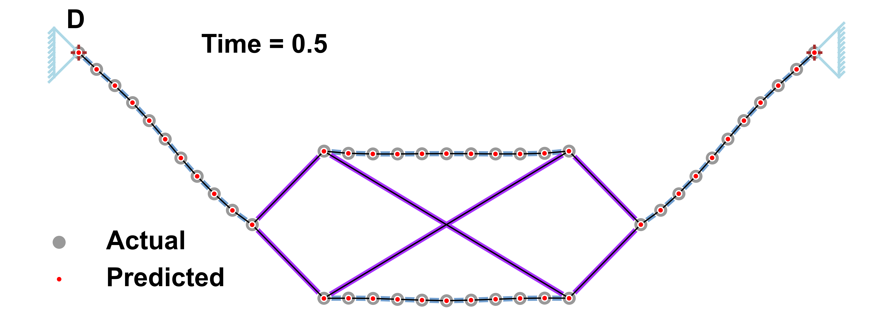

# Articulated body dynamics

The notebooks directory contains all the related ipynb notebooks.

### Chain made up of links

### Mass matrix of structure D

### Time evolution of chain-link structure (D)
|
:---:|:---
|
|
|
|
|
